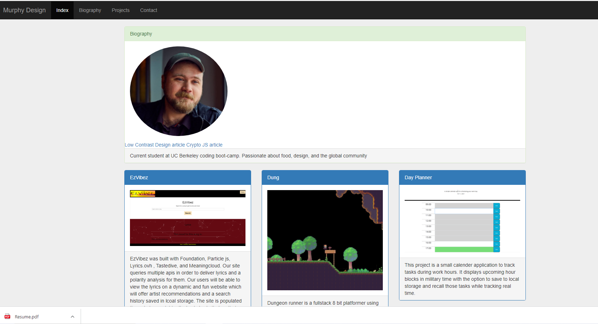

# Portfolio 3
## Table of contents
​
- [General info](#General-Info)
- [Technologies](#Technologies)
- [Deployment](#Deployment)
- [Code Overview](#Code-Overview)
- [Summary](#Summary)
​
​
## General-Info
​
General description here
This is a third portfolio demo with working buttons, pdf download and mobile first design. 

​
Deployed link: 
​
Landing page 

​
## Technologies
​
Project is created with:
​
- [Bootstrap](https://getbootstrap.com/)
​
## Containers
​

- Bootstrap
- HTML
- CSS
- Heroku
​
## Deployment
​This page is deployed on Heroku.
​https://radiant-taiga-25897.herokuapp.com/
​

​
## Authors
​
- Gavin Murphy

​
## License
​
- Open Source